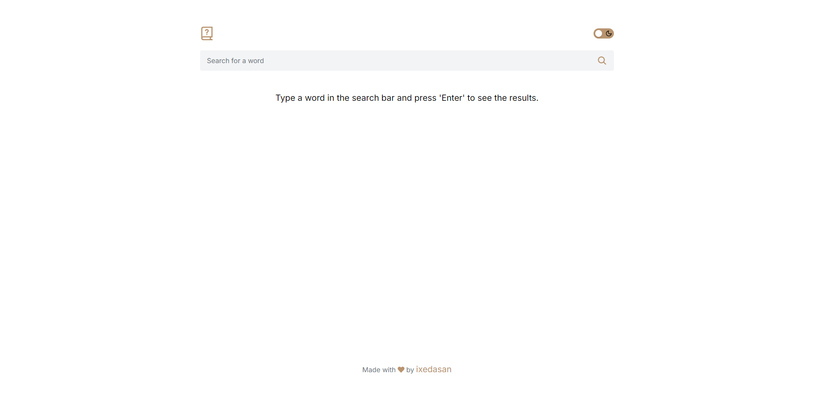
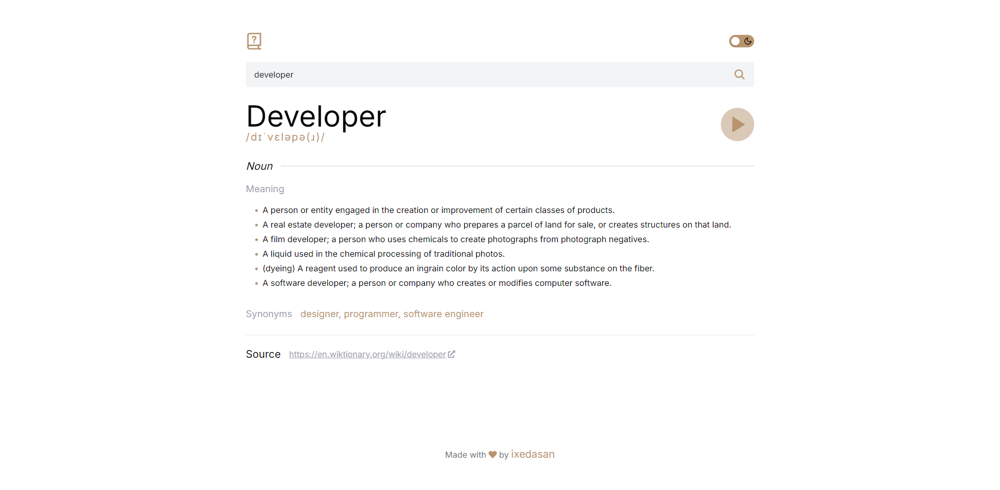
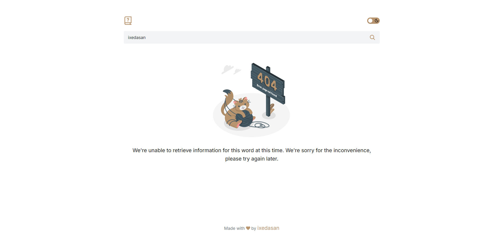
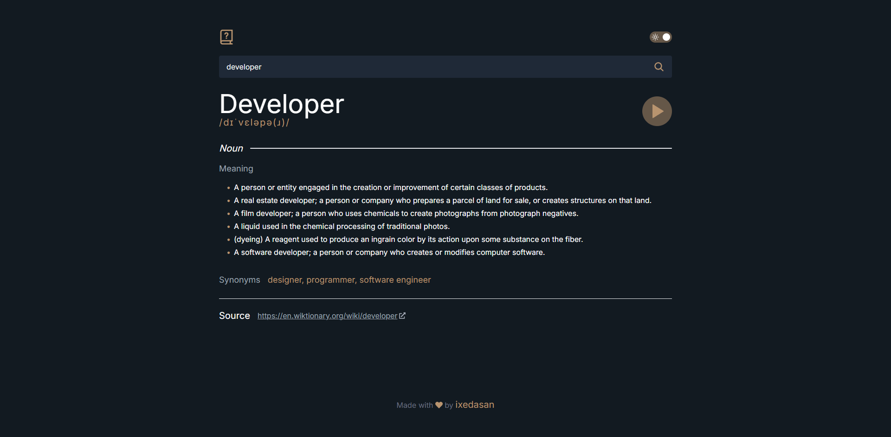

# Dictionary App

A modern, responsive dictionary application built with React and Next.js. This app allows users to search for word definitions, hear pronunciations, and view detailed linguistic information.

<div align="center">
  <h3>
    <a href="https://dictionary-app-tau-gray.vercel.app/" target="_blank">
      Demo URL
    </a>
  </h3>
</div>

## Features

- Word search functionality
- Phonetic pronunciation
- Audio playback of word pronunciation
- Detailed word meanings, including:
  - Part of speech
  - Definitions
  - Synonyms
- Source links for further reading
- Dark/Light theme switcher
- Responsive design for various screen sizes

## Technologies Used

- React
- Next.js
- TypeScript
- TanStack Query (React Query)
- Tailwind CSS
- Prettier
- ESLint

## Installation

To clone and run this application, you'll need [Git](https://git-scm.com/) and [NPM](https://nodejs.org/en/download/package-manager) installed on your computer. From your command line:

```bash
# Clone this repository
$ git clone https://github.com/ixedasan/dictionary-app

# Navigate to the project directory
$ cd dictionary-app

# Install dependencies
$ npm install

# Start the development server
$ npm run dev
```

## Preview






## API

This project uses the [Free Dictionary API](https://dictionaryapi.dev/) to fetch word data.

## Contributing

Contributions are welcome! Please feel free to submit a Pull Request.
